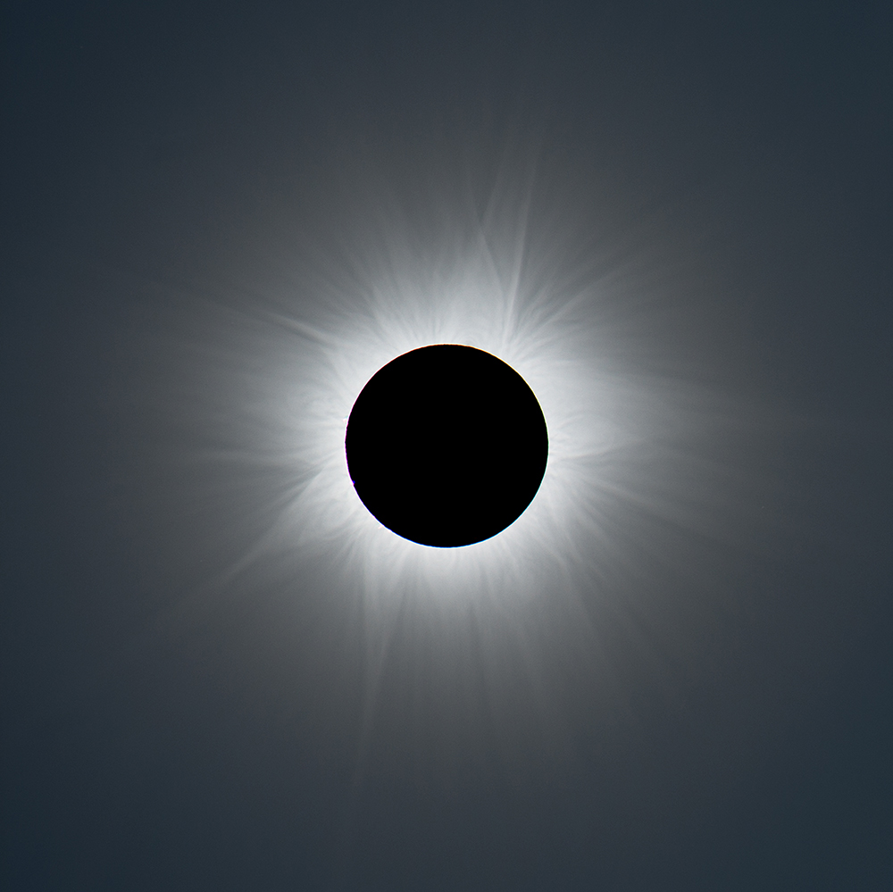
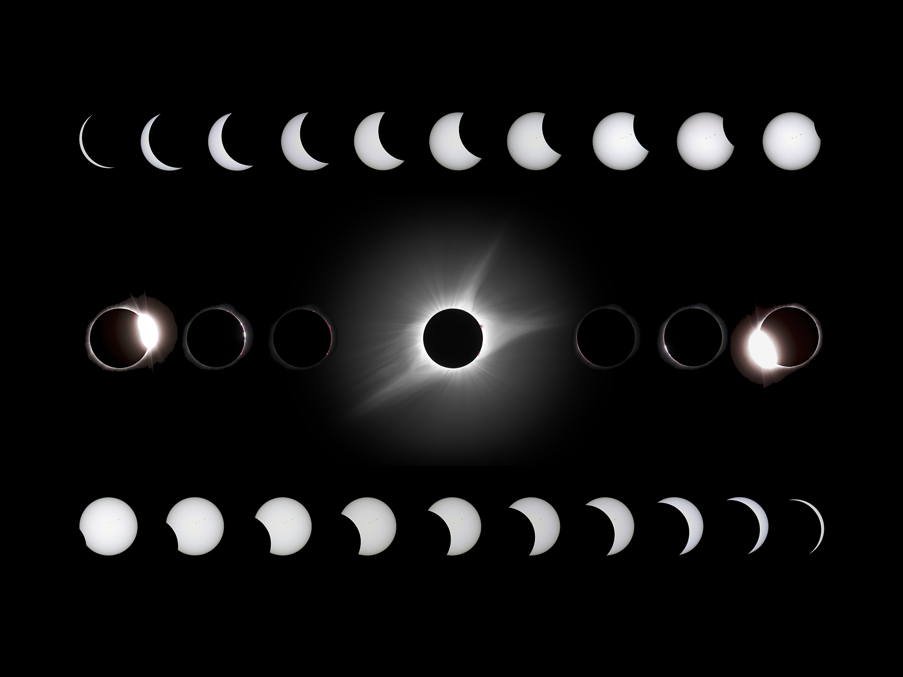

<h1>Technologies Used:</h1>

Javascript, JQuery, HTML, Bootstrap

This is a triva game based on solar eclipses.  The solar eclipse data used for this game was found on https://eclipse.aas.org/resources/images-videos#other and https://svs.gsfc.nasa.gov/.

Game Directions:
1. Click the start button to begin.
2. Answer as many questions as you can about Solar Eclipses.
3. You have 30 seconds to answer each question. 
4. Good luck!

<!--  -->

Credit: Robert B. Slobins

Credit: Rick Fienberg / TravelQuest International

Credit: NASA/Bill Ingalls

All of the solar eclipse images were found on https://svs.gsfc.nasa.gov and https://eclipse.aas.org

