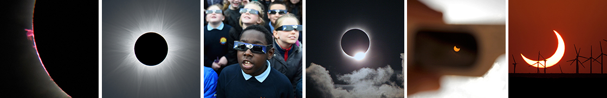

Technologies Used:

Javascript, JQuery, HTML, Bootstrap, CSS

Directions:
1. Click the start button to begin.
2. Answer as many questions as you can about Solar Eclipses.
3. You have 30 seconds to answer each question. 
4. Good luck!

  https://encrypted-tbn0.gstatic.com/images?q=tbn:ANd9GcS_qirdoJwoo8JsN9vxWLMsxAWg1-V0Lun4QeB_owsa1HuDEvpRbw

